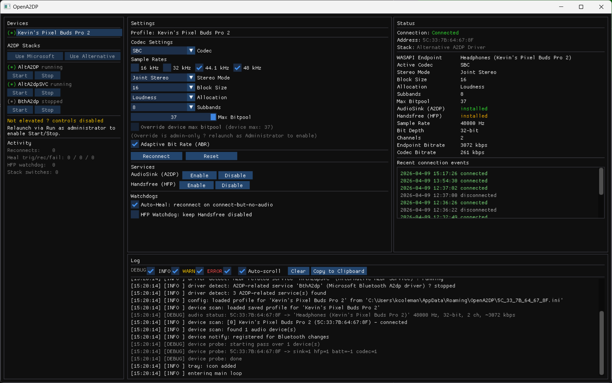

# OpenA2DP



A minimal **Windows-only** Bluetooth A2DP control tool. Manage your Bluetooth stereo audio devices with per-device profiles, live connection status, codec configuration via the Alternative A2DP Driver, and diagnostic logging.

[](https://github.com/birdybro/OpenA2DP/actions/workflows/build.yml)
[](https://github.com/birdybro/OpenA2DP/releases/latest)


> **Windows only.** OpenA2DP is built directly on Win32 Bluetooth APIs, MMDevice/WASAPI, and Direct3D 11. It will not build on Linux or macOS, will not run under WINE, and is not a candidate for a cross-platform port. **Do not file issues about non-Windows platforms** — they will be closed. On Linux, use BlueZ + PipeWire/PulseAudio, which already covers everything this tool does and far more.

## Download

Pre-built binaries are published on the [Releases page](https://github.com/birdybro/OpenA2DP/releases/latest). Each release zip contains both `OpenA2DP.exe` (the GUI) and `OpenA2DP-cli.exe` (the headless CLI). No installer — just unzip and run.

If you'd rather track the bleeding edge, every push to `main` produces a fresh build artifact in the [Actions tab](https://github.com/birdybro/OpenA2DP/actions/workflows/build.yml). Pick the latest run, scroll to "Artifacts", download `OpenA2DP-windows-x64`.

## Features

- **Device discovery** — Lists paired Bluetooth audio devices with live connection status
- **Top-of-window stack indicator** — Single colored line showing the inferred active A2DP stack (Microsoft / Alternative / Multiple / None) so you always know what's routing audio without scrolling the status panel
- **Live codec settings via Alternative A2DP Driver** — When the [Alternative A2DP Driver](https://www.bluetoothgoodies.com/) is installed, OpenA2DP reads its per-device registry config and lets you edit codec / SBC / AAC parameters live: codec selection (SBC / AAC), SBC channel mode / block size / allocation / subbands / max bitpool, AAC bitrate slider (auto-capped at the device's reported max), allowed sample rates per codec, and ABR enable. Changes go through Apply / Apply & Reconnect / Discard buttons that write the driver's `Next` registry subkey and trigger a reconnect cycle so the new settings take effect immediately.
- **Per-field dirty highlighting** — Codec widgets whose value differs from the registry snapshot get an amber background, so you can see exactly which fields you've edited
- **Bitpool device-cap safety guard** — The bitpool slider's max defaults to the device's reported `Capability.SbcMaximumBitpool`. Going above the device's claimed max can produce broken audio or damage some Bluetooth chips, so an explicit "Override device max" toggle (admin only) is required to push higher.
- **Hover tooltips** — Every codec / SBC / AAC / watchdog parameter has hover help explaining what it does
- **Audio endpoint status** — Shows real sample rate, bit depth, channel count, live codec bitrate (over-the-air), audio latency, and matched WASAPI endpoint name
- **Device Capabilities subsection** — Reads the full `Capability\<addr>` registry subtree and shows what each device claims to support: codec list, SBC channel modes / rates / bitpool range, AAC channel modes / rates / max + peak bitrate
- **Bluetooth remote-event tracking** — Logs every play/pause/next/prev/volume event coming from your headphones, observed via three surfaces: a low-level keyboard hook (catches synthetic media keystrokes from older BT drivers), WASAPI default-endpoint volume polling (catches AVRCP volume swipes), and a WinRT `GlobalSystemMediaTransportControlsSessionManager` poller (catches AVRCP play/pause/next/prev that flow through SMTC instead of synthesizing keystrokes — what modern devices like Pixel Buds Pro 2 use). All events log to the standard ring buffer with a `remote:` prefix.
- **Battery level** — Reads `DEVPKEY_Bluetooth_Battery` via SetupAPI on a background thread (when the device exposes it to Windows)
- **Reconnect / Reset** — Toggle A2DP AudioSink and Handsfree services to fix connection issues
- **Manual service control** — Enable/disable AudioSink (A2DP) and Handsfree (HFP) individually to prevent unwanted profile switching
- **Auto-Heal** — Optional per-device watchdog that detects the Windows 11 "connected but no audio" bug and automatically cycles AudioSink to recover (with toast notification on success/failure). Warning is debounced over multiple poll ticks so transient races during codec switches don't false-trigger it.
- **HFP Watchdog** — Optional per-device watchdog that periodically re-disables Handsfree (HFP) so Windows can't fall back to narrowband mono SCO
- **A2DP stack control** — Detects every A2DP-related service in the Windows SCM (Microsoft `BthA2dp`, Alternative A2DP Driver, etc.) and lets you Start/Stop them or one-click switch the entire active stack (needs admin). Stack switching prompts a confirm dialog first since it interrupts audio for ~30s.
- **System tray** — Notification-area icon with right-click menu for Reconnect, Disable HFP, Switch Stack, Show/Hide window, Quit. Minimize-to-tray on the minimize button. Custom icon embedded in the binary.
- **CLI mode** — Separate `OpenA2DP-cli.exe` for headless scripting: `--reconnect`, `--disable-hfp`, `--enable-a2dp`, `--list-devices`, `--list-stacks`, `--show-codec-config`, `--set-codec`, `--set-bitpool`, `--set-aac-bitrate`, `--switch-stack`, `--start-service`, `--stop-service`, `--probe-registry`
- **Connection history** — Persistent per-device timestamped connect/disconnect log in `%APPDATA%\OpenA2DP\<addr>.history`, last 12 events shown in the status panel
- **Activity counters** — Per-session running totals of reconnects, auto-heal triggers/recoveries/failures, HFP watchdog actions, and stack switches
- **Diagnostic logging** — Color-coded severity levels, filterable, with auto-scroll, and a one-click "Copy to Clipboard" for issue reports
- **Persistent settings** — Per-device profiles, window position/size, and connection history all auto-save to `%APPDATA%\OpenA2DP\` and reload on startup

## Building

If you don't want to build from source, just grab the latest [release zip](https://github.com/birdybro/OpenA2DP/releases/latest) — it's signed with nothing fancy but the same binaries CI produces.

### Requirements

- Windows 10/11
- Visual Studio 2022+ with **Desktop development with C++** workload
- Windows SDK
- Git (for cloning with submodules)

### Build

```
git clone --recurse-submodules https://github.com/birdybro/OpenA2DP.git
cd OpenA2DP
scripts\build.bat
```

The build script auto-detects whether `cl.exe` is already on `PATH` (developer command prompt or CI environment) and only falls back to a hardcoded `vcvarsall.bat` location for local dev otherwise.

Outputs **two binaries**:
- `build\OpenA2DP.exe` — the GUI (Windows subsystem, no console flash on launch)
- `build\OpenA2DP-cli.exe` — the headless command-line tool (Console subsystem, so cmd.exe waits for it properly)

Both share the same object files; the linker just produces two executables with different `/SUBSYSTEM` and entry points.

### Versioning

Version numbers are embedded in both binaries via `scripts/version_gui.rc` and `scripts/version_cli.rc` (right-click → Properties → Details to verify). To bump the version, update both `.rc` files, add a `CHANGELOG.md` entry, then `git tag v0.X.Y && git push --tags`. CI builds the tag, zips both binaries, and attaches the zip to a new GitHub Release automatically.

### Run Tests

```
tests\build_and_test.bat
```

## Usage

1. Pair your Bluetooth audio device(s) in Windows Settings
2. Run `OpenA2DP.exe`
3. Select a device from the left panel
4. Adjust codec and SBC settings as desired (settings auto-save)
5. Use **Reconnect** to re-establish the A2DP connection, or **Reset** to cycle all audio services
6. Use the **Services** section to manually enable/disable AudioSink or Handsfree
7. Optionally enable **Auto-Heal** to automatically recover from connect-but-no-audio failures on next connect
8. Optionally enable **HFP Watchdog** to keep Handsfree disabled (recommended for headphones-only use)
9. **Right-click the tray icon** for quick access to Reconnect, Disable HFP, and Switch Stack without opening the window
10. To switch between A2DP stacks (e.g. Microsoft `BthA2dp` ↔ Alternative A2DP Driver), launch `OpenA2DP.exe` **as Administrator** and use the **Use Microsoft / Use Alternative** buttons in the A2DP Stacks panel

### Command-line use

Use the separate `OpenA2DP-cli.exe` for scripting and Task Scheduler:

```
OpenA2DP-cli.exe --reconnect AA:BB:CC:DD:EE:FF
OpenA2DP-cli.exe --disable-hfp AA:BB:CC:DD:EE:FF
OpenA2DP-cli.exe --enable-a2dp AA:BB:CC:DD:EE:FF
OpenA2DP-cli.exe --list-devices
OpenA2DP-cli.exe --list-stacks
OpenA2DP-cli.exe --switch-stack ms          # needs admin
OpenA2DP-cli.exe --switch-stack alt         # needs admin
OpenA2DP-cli.exe --start-service BthA2dp    # needs admin
OpenA2DP-cli.exe --stop-service AltA2DP     # needs admin
OpenA2DP-cli.exe --help
```

The CLI binary is a separate `/SUBSYSTEM:CONSOLE` executable so cmd.exe and PowerShell wait for it properly. Service-control commands (`--switch-stack`, `--start-service`, `--stop-service`) require running the terminal as Administrator.

## Architecture

```
app/        UI (Win32 + D3D11 + cimgui), window management, tray icon, CLI dispatch
core/       Types, config (INI), validation, logging (ring buffer), stats counters, history
service/    Bluetooth device enumeration, audio status, reconnect/reset, auto-heal,
            HFP watchdog, A2DP stack control, background device probe
include/    Shared C headers
third_party/  cimgui (Dear ImGui C bindings)
```

Written in C with minimal C++ only where required (COM APIs, ImGui backends). See [CLAUDE.md](CLAUDE.md) for detailed architecture notes.

## How It Works

- **Device scan**: Uses `BluetoothFindFirstDevice` / `BluetoothGetDeviceInfo` to enumerate paired Bluetooth audio devices, filtered by Class of Device
- **Audio status**: Queries the Windows MMDevice API to match Bluetooth devices to their audio endpoints and read the actual mix format. Matches first by Bluetooth address embedded in the endpoint device ID (Microsoft stack), then falls back to substring-matching the device's display name against the endpoint friendly name (works for Alternative A2DP Driver and other third-party stacks)
- **Reconnect**: Toggles the A2DP AudioSink service off then back on via `BluetoothSetServiceState`, with retry logic
- **Reset**: Cycles both Handsfree and AudioSink services, re-establishing AudioSink last so A2DP takes priority
- **Auto-Heal**: When opted in per device, watches for connect transitions and probes WASAPI for a render endpoint after a short settle. If the endpoint is missing it runs a reconnect cycle, retrying up to a hard cap. Skips when a manual action is in flight to avoid races. See [docs/driver-evaluation.md](docs/driver-evaluation.md) for the design rationale.
- **Background device probe**: Slow Bluetooth APIs (`BluetoothEnumerateInstalledServices`, SetupAPI battery property reads) run on a single-slot worker thread, never on the UI thread, because they can block for seconds and freeze the window. Results trickle into the status struct and are picked up by the next UI frame.
- **A2DP stack control**: Enumerates Win32 services and kernel drivers via the SCM (`EnumServicesStatusExW`) and matches anything containing "a2dp" in name or display name. Start/Stop go through `StartServiceW` / `ControlService(SERVICE_CONTROL_STOP)` with state-poll waits. Stack switching runs the stop/start sequence on a background worker, then issues a synchronous reconnect cycle for every connected device so they re-bind to the new stack.
- **Remote-event tracking**: `service/remote_events.cpp` installs a `WH_KEYBOARD_LL` system-wide low-level keyboard hook for `VK_MEDIA_*` virtual keys (catches drivers that translate AVRCP into synthetic keystrokes), polls the WASAPI default render endpoint's master volume on a 200 ms tick (catches AVRCP volume swipes), and calls into `service/smtc_observer.cpp` which uses C++/WinRT to poll `Windows::Media::Control::GlobalSystemMediaTransportControlsSessionManager` for `PlaybackStatus` and `MediaProperties` deltas (catches AVRCP play/pause/next/prev events that flow through the SMTC route on Win10/11). Three orthogonal observation surfaces, all logging to the standard ring buffer with a `remote:` prefix.
- **Persistence**: Per-device INI files in `%APPDATA%\OpenA2DP\`, dirty-detected and auto-saved every few seconds. Window position/size in `window.ini`. Connection history in `<addr>.history`.

## Known Limitations

- **Codec detection**: Windows does not expose A2DP codec negotiation parameters (active codec, bitpool, subbands, allocation method) in user mode. The status panel only shows fields that come from real WASAPI measurements; codec-internal fields are intentionally omitted rather than fabricated. See [docs/driver-evaluation.md](docs/driver-evaluation.md) for details.
- **Battery**: Only shows up if the device exposes battery via `DEVPKEY_Bluetooth_Battery` to the Windows BT stack. Many headphones don't, in which case the row is omitted entirely.
- **Active stack label is machine-wide**: Inferred from which SCM services are running, not from inspecting the audio endpoint of a specific device. If two stacks somehow run simultaneously, OpenA2DP labels it "Multiple stacks running" rather than guessing per-device.
- **Service control needs admin**: Start/Stop and Switch Stack go through the Service Control Manager which requires elevation. If you launched OpenA2DP normally, those buttons are greyed out and the footer shows "Not elevated — controls disabled". Right-click → Run as administrator to enable them.
- **Bluetooth stack dependency**: Service toggle behavior depends on the Windows Bluetooth driver stack. Some devices or drivers may not respond to `BluetoothSetServiceState` as expected.
- **Tested stacks**: Microsoft stock Bluetooth stack and Alternative A2DP Driver (bluetoothgoodies.com). Other third-party stacks should work but are untested — if endpoint detection fails, check the log for the enumerated-endpoints dump and file an issue.

## License

GPL-3.0. See [LICENSE](LICENSE).

## Credits

Application icon by [Ramy W.](https://www.flaticon.com/authors/ramy-w) on Flaticon.
